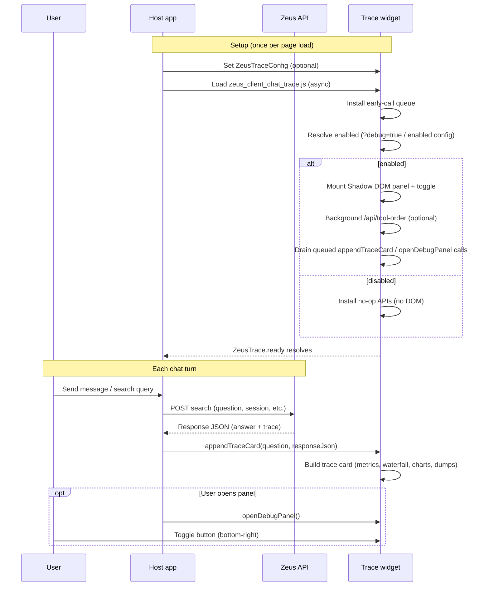

# zeus_client_chat_trace

Embeddable Zeus trace debugger widget. Drop a single script tag into any host page to surface a floating debug panel that visualizes Zeus search traces — timing breakdowns, waterfall timelines, tool-call frequency, and expandable JSON dumps.

## What it does

When a host application calls the Zeus search API, the response includes a `trace` object with step-by-step execution data (LLM rounds, tool calls, spans, token usage, and more). This widget renders that data in a developer-friendly panel without modifying the host app's layout or styles.

**Key capabilities:**

- **One-script embed** — Load `dist/zeus_client_chat_trace.js` asynchronously; the widget mounts itself in an isolated Shadow DOM.
- **Debug kill switch** — UI is **off by default**. Show it with `?debug=true` on the host page URL, or set `ZeusTraceConfig.enabled = true` / `data-enabled="true"`.
- **Trace cards** — Each search turn becomes a card showing the user query, API version, target, round count, and session/contract badges.
- **Performance metrics** — Stacked bar showing AI vs Zeus vs other time, DaisyUI token stats (`in` / `out` / `total` from LLM `usage`), and byte totals. A running total aggregates across turns.
- **Waterfall timeline** — Visual span chart for LLM and tool execution, with pipeline steps expanded inline.
- **Tool-call frequency chart** — Bar chart ordered by the Zeus `/api/tool-order` endpoint (falls back gracefully when the API is unreachable).
- **JSON dumps** — Collapsible sections for AI requests/responses (by round), tool calls, and the raw turn bundle. Uses [jsnview](https://www.npmjs.com/package/jsnview) (lazy-loaded from CDN `index.min.js`) with a plain-text fallback.
- **Early-call queue** — Calls to `appendTraceCard` or `openDebugPanel` made before the script finishes loading are buffered and replayed automatically.
- **Copy all** — Export the current trace session to the clipboard as JSON.

The widget does **not** perform searches itself. The host app is responsible for calling Zeus and passing the response to `appendTraceCard`.

## Chat trace flow

The widget sits beside your chat UI as a passive observer. Your app owns the conversation and the Zeus API call; the widget only receives the response and renders the `trace` payload.



### Phases

**1. Embed and bootstrap**

1. The host page optionally sets `window.ZeusTraceConfig` (or `data-*` attributes on the script tag).
2. The async bundle loads. Before mount completes, `appendTraceCard` and `openDebugPanel` are stubbed to push into an **early-call queue** so nothing is lost.
3. On `DOMContentLoaded`, `bootstrap.js` resolves config and the **enabled kill switch** (see below). If disabled, it installs no-op APIs, skips DOM/DaisyUI, and resolves `ZeusTrace.ready` immediately.
4. When enabled, it creates `#zeus-trace-host`, attaches an open Shadow DOM, injects DaisyUI + widget markup/styles, calls `initZeusTrace`, installs globals, and drains the early-call queue. `ZeusTrace.ready` resolves at this point.
5. Config is resolved (`ZeusTraceConfig` → script `data-*` → build-time `.env` defaults). If `toolOrder` is injected it is used immediately; otherwise, when `zeusApiUrl` is set, the widget **best-effort** fetches `/api/tool-order` (3s timeout) in the background to order tool-frequency bars. This fetch never blocks the widget or `appendTraceCard`.
6. Host calls continue to work even if tool-order is slow, fails, or hangs (and are silent no-ops when the widget is disabled).

### Kill switch (show / hide)

The floating panel is **hidden by default** so end users never see the debugger unless you opt in.

| Source | How to enable | Notes |
|--------|---------------|--------|
| Page URL | `?debug=true` (also `1`, `yes`, `on`) | Most common for demos / support |
| Config | `window.ZeusTraceConfig.enabled = true` | Always on for that host |
| Script attr | `data-enabled="true"` | Same as config |
| Disable | `enabled: false`, `data-enabled="false"`, or `?debug=false` | Explicit config wins over the query string |

Resolution order: **explicit `enabled` / `data-enabled`** → **`debug` query param** → **default `false`**.

When disabled: no `#zeus-trace-host`, no DaisyUI load, no tool-order fetch. `appendTraceCard` / `openDebugPanel` remain safe no-ops. Check `ZeusTrace.config.enabled` after ready.

**2. Search (host responsibility)**

The widget never calls Zeus search. For each user turn, the host app:

1. Sends the user's question to the Zeus search endpoint.
2. Receives a JSON body that includes `answer` and a `trace` object (rounds, spans, steps, `ai_requests`, `tool_calls`, optional session/contract metadata).

**3. Ingest trace (`appendTraceCard`)**

When the host calls `appendTraceCard(question, responseJson)`:

| Step | What happens |
|------|----------------|
| Validate | Returns early if `responseJson.trace` is missing |
| Session | Updates `chat_id` and appends to the in-memory trace session |
| Card header | Turn number, query, API version, target, round count, session/contract badges |
| Metrics bar | AI vs Zeus vs other time; DaisyUI token stats (`in`/`out`/`total` from step `usage`); bytes; running total across turns |
| Waterfall | Span timeline from `trace.spans`; `tool.pipeline` steps expand into sub-spans |
| Tool chart | Frequency bars from `trace.steps`, ordered by `/api/tool-order` when available |
| Text dump | Collapsible "Hash Traces" step summary |
| Hash Traces | Round-by-round `[rN] LLM` / `[rN] TOOL` lines from `trace.steps` (falls back to `tool_calls`) |
| JSON dumps | Lazy-loaded jsnview trees for AI requests/responses, tool calls, and the raw turn bundle |
| Retention | Keeps the latest 12 cards; older cards roll off the list |

**4. User interaction**

- The floating toggle (bottom-right) opens/closes the panel without host code.
- `openDebugPanel()` lets the host surface the panel immediately after a search.
- **Copy all** exports the current session (`chat_id` + trace entries) as JSON to the clipboard.

### Data path (one turn)

```
User query
    → Host app → Zeus search API
        → responseJson { answer, trace: { spans, steps, ai_requests, tool_calls, ... } }
            → appendTraceCard(question, responseJson)
                → Shadow DOM trace card (#1, #2, …)
                    → metrics · waterfall · tool chart · JSON dumps
```

See `examples/embed.html` for a working host that queues an early trace, then appends fixture data on button click.

## Prerequisites

- [Node.js](https://nodejs.org/) 18 or later
- npm

## Quick start

### 1. Install and build

```bash
git clone <repo-url>
cd zeus_client_chat_trace
npm install
npm run build
```

This produces `dist/zeus_client_chat_trace.js` (minified, with source map).

**Optional — build-time defaults:** Copy `.env.example` to `.env` and set defaults that apply when no runtime config is provided:

```bash
cp .env.example .env
```

| Variable | Description |
|----------|-------------|
| `ZEUS_API_URL` | Default Zeus API base URL (e.g. `http://localhost:8080`) |
| `ZEUS_AUTH_TOKEN` | Default Bearer token for Zeus API requests |

Runtime config always overrides these build-time values.

### 2. Embed in your host page

Add configuration and the script tag to any HTML page:

```html
<script>
  window.ZeusTraceConfig = {
    zeusApiUrl: "https://zeus.example.com",
    zeusAuthToken: "optional-bearer-token",
    hubBaseUrl: "http://hub",
    // Optional hard enable. Omit and use ?debug=true on the page instead.
    // enabled: true,
  };
</script>
<script src="/dist/zeus_client_chat_trace.js" async></script>
```

Alternatively, pass config via data attributes on the script tag:

```html
<script
  src="/dist/zeus_client_chat_trace.js"
  async
  data-zeus-api-url="https://zeus.example.com"
  data-zeus-auth-token="optional-bearer-token"
  data-hub-base-url="http://hub"
  data-enabled="true"
></script>
```

Config resolution order: `window.ZeusTraceConfig` → script `data-*` attributes → build-time `.env` defaults.

**Visibility:** without `enabled: true` / `data-enabled="true"`, open the host page with `?debug=true` (e.g. `https://app.example/?debug=true`) or the panel will not mount.

`hubBaseUrl` is the Hub / Detective origin (often different from the public API, e.g. admin port `:9091`). When unset, the Detective link stays hidden.

### 3. Feed traces after each search

After your app receives a Zeus API response, pass the user query and full JSON body to the widget. Ensure `session_id` is on the payload when available (Detective links by session):

```js
// responseJson must include a `trace` object
window.appendTraceCard(userQuery, {
  ...responseJson,
  session_id: responseJson.session_id,
});

// Optionally open the panel immediately
window.openDebugPanel?.();
```

Wait for the widget to finish mounting before relying on the real implementations (optional, but useful if you need config or error handling):

```js
const { api, config } = await window.ZeusTrace.ready;
api.appendTraceCard(userQuery, responseJson);
api.openDebugPanel();
```

A floating toggle button (bottom-right) lets users open and close the panel at any time.

When `session_id` (or `trace.session.id`) and `hubBaseUrl` are both set, the panel title stays **Zeus Tracer** and a **Detective ↗** link opens `{hubBaseUrl}/hub/debug/session/{session_id}` in a new tab.

Session-id resolution: top-level `session_id` → `trace.session_id` → `trace.session.id` → `trace.session.session_id` → `session.id`.

### 4. Try the local demo

```bash
npm run build
npm run serve
```

Open [http://localhost:5199/examples/embed.html](http://localhost:5199/examples/embed.html) (or [http://localhost:5199/embed.html](http://localhost:5199/embed.html)).

The demo page simulates a host app: it queues an early trace before the script loads, then lets you append additional fixture traces and open the panel.

## API reference

| Global | Description |
|--------|-------------|
| `window.ZeusTraceConfig` | Set **before** loading the script. `{ zeusApiUrl, zeusAuthToken, hubBaseUrl, toolOrder, enabled }` |
| `window.appendTraceCard(question, responseJson)` | Append a trace card. `responseJson.trace` is required. Prefer also passing `session_id` for the Detective deep-link. No-op when the widget is disabled. |
| `window.openDebugPanel()` | Show the debug panel. No-op when disabled. |
| `window.ZeusTrace.ready` | Promise resolving to `{ api, config }` once bootstrap finishes (mounted or intentionally disabled). |
| `window.ZeusTrace.config` | Read-only public config (`zeusApiUrl`, `hubBaseUrl`, `toolOrder`, `enabled`, `version`; token is never exposed). |
| `window.ZeusTrace.version` | Built widget version from `package.json` (also shown in the panel footer when mounted). |

### Expected response shape

`appendTraceCard` expects the Zeus API response JSON. At minimum, `responseJson.trace` must be present:

```js
{
  chat_id: "optional-host-chat-id",
  session_id: "optional-zeus-session-id",
  api_version: "v2",
  target: "search-target",
  answer: "...",
  trace: {
    rounds: 2,
    total_ms: 1250,
    spans: [ /* { name, cls, at, ms } */ ],
    steps: [ /* { type, round, ms, name, status, ... } */ ],
    ai_requests: [ /* ... */ ],
    tool_calls: [ /* ... */ ],
    session: { /* optional */ },
    contract: { /* optional */ },
  }
}
```

See `examples/embed.html` for a complete fixture.

## Development

| Command | Description |
|---------|-------------|
| `npm run dev` | Rebuild on file changes (`esbuild --watch`) |
| `npm run serve` | Static file server on port 5199 |
| `npm test` | Run unit tests once |
| `npm run test:watch` | Run tests in watch mode |
| `npm run test:coverage` | Run tests with coverage report |

### Project layout

```
src/
  bootstrap.js      Entry point — mounts Shadow DOM, exposes globals
  trace.js          Trace card rendering, charts, metrics
  config.js         Config resolution and Zeus API fetch helper
  jsnview-loader.js Lazy-loads jsnview from CDN
  widget.html       Panel markup (injected into shadow root)
  widget.css        Widget styles
dist/
  zeus_client_chat_trace.js   Built bundle (commit or deploy this)
examples/
  embed.html        Local integration demo
```

## Troubleshooting

| Symptom | Likely cause | Fix |
|---------|--------------|-----|
| No toggle / no `#zeus-trace-host` | Kill switch off (default) | Add `?debug=true` to the page URL, or set `ZeusTraceConfig.enabled = true` / `data-enabled="true"` |
| Tool frequency chart has no canonical order | `zeusApiUrl` unset, `/api/tool-order` unreachable, or only `toolOrder.v1` filled while turns are v2 | Inject `ZeusTraceConfig.toolOrder`, or set a same-origin `zeusApiUrl`; check Network tab |
| Widget toggle present but no cards after search | Host never called `appendTraceCard`, or payload missing `trace` | Call `appendTraceCard(query, data)` with `data.trace` |
| Panel not visible (toggle exists) | Panel starts closed (`is-hidden`) | Click the lightning toggle (bottom-left) or call `openDebugPanel()` |
| JSON dumps show plain `<pre>` instead of tree viewer | jsnview CDN blocked | Allow `cdn.jsdelivr.net`, or rely on the text fallback |
| No tool-call rounds / dumps never appear | Stale bundle with broken jsnview URL hanging load | Redeploy rebuilt `dist/zeus_client_chat_trace.js` |
| Widget styles missing | DaisyUI CDN blocked | Allow `cdn.jsdelivr.net` |
| Early `appendTraceCard` calls lost | Custom stub overwrote the queue | Use the built bundle as-is; it installs the queue before mount |
| Detective link hidden or wrong | Missing `hubBaseUrl` / `session_id`, or stale bundle still on `/hub/debug/req/...` | Set `ZeusTraceConfig.hubBaseUrl`; ensure payload includes `session_id`; rebuild/sync widget |

## Docs

- Feature guide: [`.grok/guides/EMBEDDABLE_TRACE_WIDGET.md`](.grok/guides/EMBEDDABLE_TRACE_WIDGET.md)
- Jira: [ZC-31](https://kotenai.atlassian.net/browse/ZC-31)